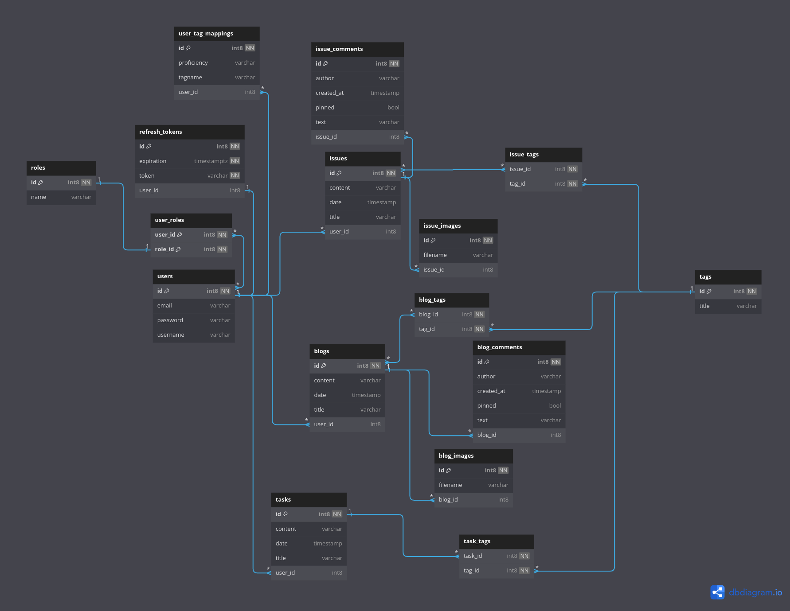

# pd-dashboard-backend
This project is Spring boot application for community knowledge sharing. This is developed using Spring boot-3 & Spring security 6.

# Environment Setup
Install Docker Compose on your machine
Pull postgres official image from DockerHub

All the commands regarding spin up the container and spring boot applicatin startup are specified in start.sh. Just the script

# Command
    sudo chmod +x start.sh
    ./start.sh

# Database Diagram

  